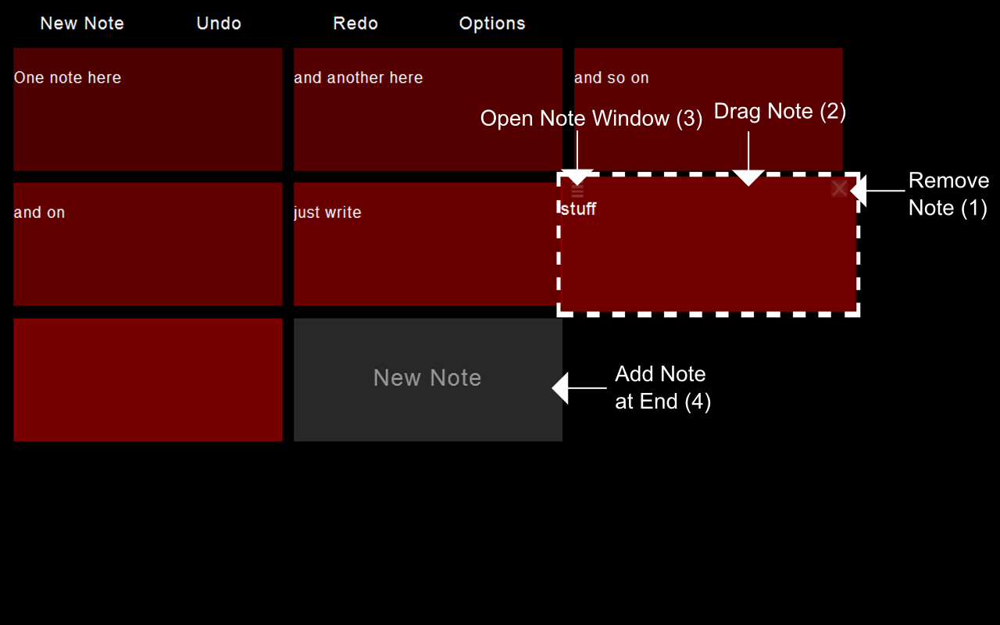
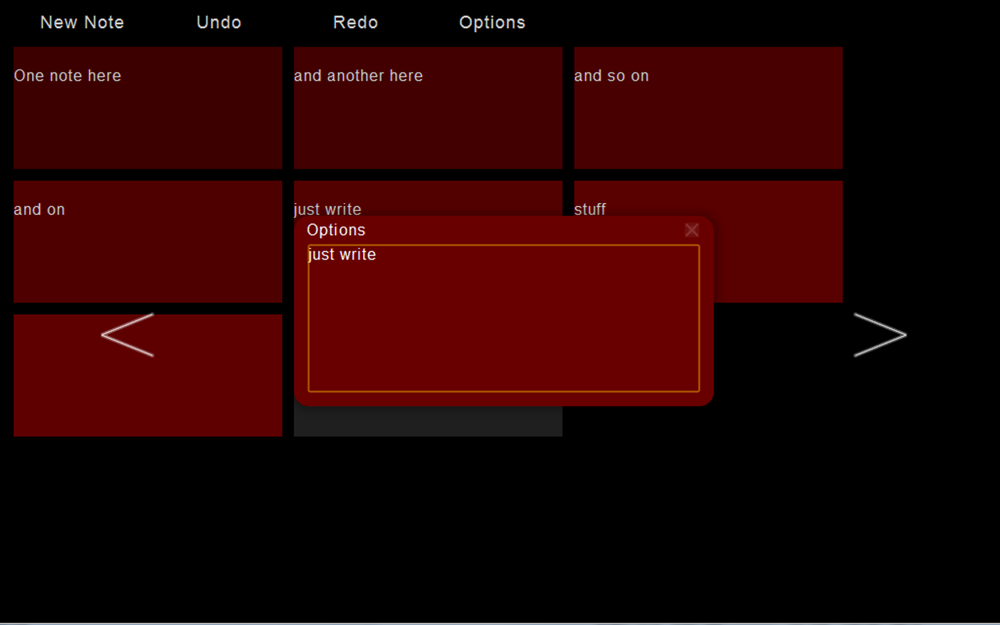
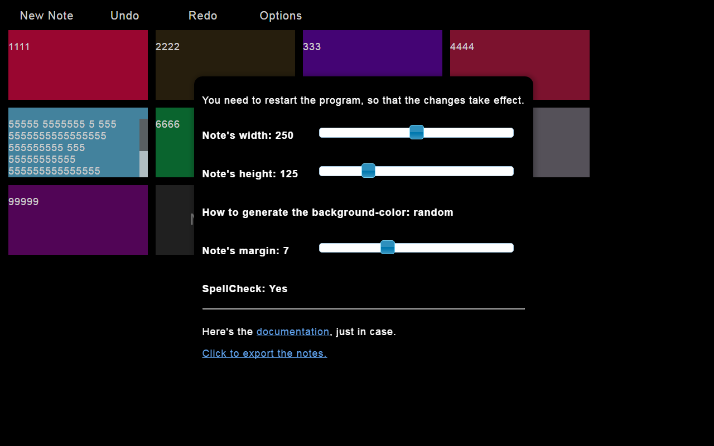

# [Try it out here!](http://nbpt.eu/app/notes/) #

# Description #

A simple program for quick notes.
The data is saved locally on your browser.

1. Removes the note (you can still get it back by clicking 'Undo' in the menu).
2. Click and hold on the top part of the note, and drop it on top of other note (to move it to that place).
3. Opens the note's window, where you can edit the note as well.
Close it by pressing the 'Esc' key, or by clicking outside of the window.
4. Adds a new note at the end (the same as pressing the 'New Note' on the menu).

A window where you can easily edit the note.

In the 'Options' window, you can set a fixed background color for this particular note (or allow it to be generated, the default).

## Note's width/height ##

Change the note's dimensions (of all of them).

## How to generate the background color ##

- `color_gradient:` A gradient between the 2 selected colors.
- `fixed_order:` A fixed pattern with 3 colors.
- `random:` A random color for each note at random (changes every time).

## Note's margin ##

The space between the notes.

## Spellcheck ##

If the spellcheck is activated or not.

# Keyboard Shortcuts #

## Menu shortcuts ##

- `alt + 1` : new note.
- `alt + 2` : undo of added/removed/dragged notes.
- `alt + 3` : redo of added/removed/dragged notes.
- `alt + 4` : open options.

## When a note is on focus ##

- `alt + q` : Focus to the note on the left.
- `alt + w` : Focus to the note on the right.
- `alt + e` : Open the note's window.
- `alt + a` : Create a new note in the next position.
- `alt + s` : Delete the note.

## When there isn't a note on focus ##

- `alt + q` : Put focus on the last child, or on the dummy note (if there's no notes yet).
- `alt + w` : Put focus on the first child, or on the dummy note (if there's no notes yet).

## When the note's window is opened ##

- `alt + q` : Focus to the note on the left.
- `alt + w` : Focus to the note on the right.
- `alt + a` : Create a new note in the next position.
- `alt + s` : Remove the selected note.
- `esc` : Close the window.

## When focus on the dummy note ##

- `alt + q`: Go to the last note.
- `alt + w`: Go to the first note.
- `enter` or `tab`: Create a new note.

# Dependencies #

- jquery -- 3.2
- jqueryui -- 1.12
    - position
    - start theme
    - slider
    - blind effect
    - fade effect